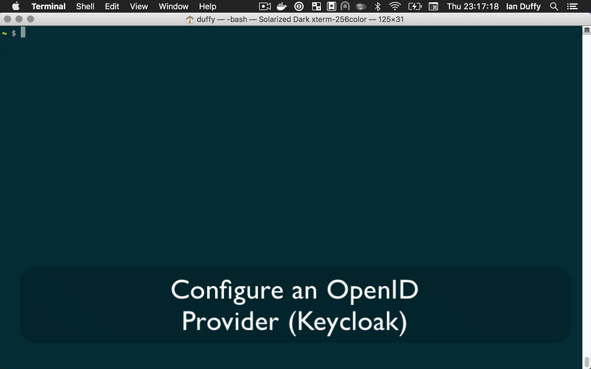

[](https://github.com/imduffy15/token-cli/blob/master/LICENSE)


# TokenCLI

_tokenCLI_ is a command line utility for generating tokens from a OpenID identity provider, such as [Keycloak](https://www.keycloak.org/).

_tokenCLI_ uses the [Authorization Code Grant Flow](https://developer.okta.com/authentication-guide/implementing-authentication/auth-code), as such a refresh token is generated and used to automatically renew the access token without browser interaction.



## Installation

### OSX

Install:

```
brew install imduffy15/tap/token-cli
```

Upgrade:

```
brew upgrade token-cli
```


## Alternative Installs (tar.gz, RPM, deb, snap)
Check out the [releases](https://github.com/imduffy15/token-cli/releases) section on Github for alternative binaries.

## Contribute
[Fork token-cli](https://github.com/imduffy15/token-cli) and build a custom version. We welcome any useful pull requests.

## Usage

Create a new target called example-realm:

```
$ token-cli target create example-realm -t http://localhost:8080/auth/realms/example-realm/.well-known/openid-configuration
```

Set example-realm as the active target:

```
$ token-cli target set example-realm
```

Get a token for the client "service-template" with redirection port 9090

```
$ token-cli token get service-template -p 9090
```

## Help

```bash
$ token-cli --help
Token Command Line Interface, version

Usage:
  token-cli [command]

Available Commands:
  help        Help about any command
  target      Configure and view OIDC targets
  token       Configure and view tokens

Flags:
  -h, --help      help for token-cli
  -v, --verbose   See additional info on HTTP requests

Use "token-cli [command] --help" for more information about a command.
```

```bash
$ token-cli target --help
Configure and view OIDC targets

Usage:
  token-cli target [flags]
  token-cli target [command]

Available Commands:
  create      Creates a new target
  delete      Delete the target named TARGET_NAME
  get         View the target named TARGET_NAME
  list        List all targets
  set         sets TARGET_NAME as active

Flags:
  -h, --help                  help for target
  -k, --skip-ssl-validation   Disable security validation on requests to this target

Global Flags:
  -v, --verbose   See additional info on HTTP requests

Use "token-cli target [command] --help" for more information about a command.
```

```bash
$ token-cli token --help
Configure and view tokens

Usage:
  token-cli token [command]

Available Commands:
  get         Obtain a token for the specified CLIENT_ID

Flags:
  -h, --help   help for token

Global Flags:
  -v, --verbose   See additional info on HTTP requests

Use "token-cli token [command] --help" for more information about a command.
```

## License 

Apache License 2.0  
